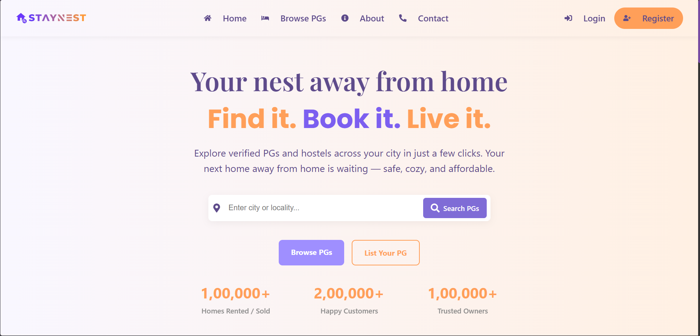
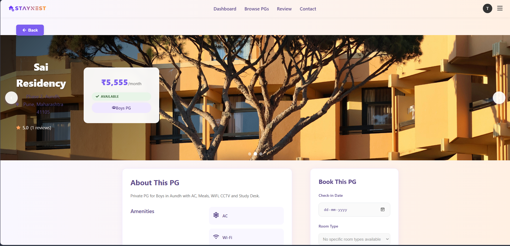
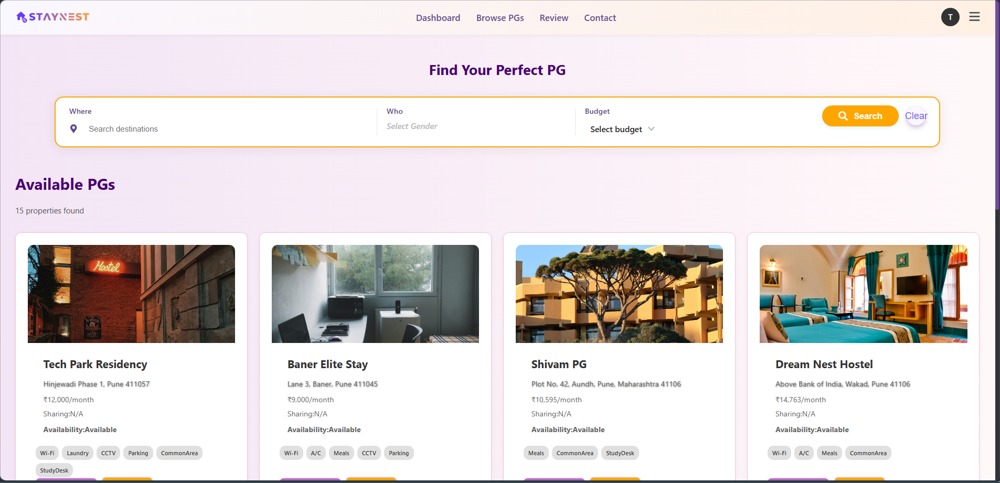
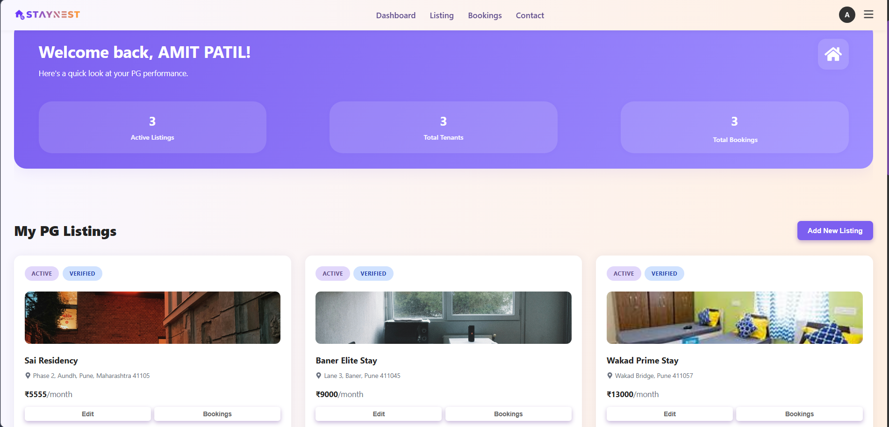

<div align="center">

# 🏠 StayNest

### A Full-Stack PG Rental Platform

*Search, book, and review PG accommodations — all in one place.*

[](https://staynest-dep.onrender.com/)
[](https://staynest-8483.postman.co/)
[](https://formspree.io/f/xrblqpbe)


</div>

---

## 📋 Table of Contents

- [Overview](#-overview)
- [Tech Stack](#-tech-stack)
- [Features](#-features)
- [Architecture](#-architecture)
- [Screenshots](#-screenshots)
- [API Documentation](#-api-documentation)
- [Setup Instructions](#-setup-instructions)
- [Environment Variables](#-environment-variables)
- [Deployment](#-deployment)
- [Future Improvements](#-future-improvements)
- [License](#-license)

---

## 🔍 Overview

**StayNest** is a production-ready, full-stack PG (Paying Guest) rental platform built to streamline the rental experience for both tenants and property owners.

- **Tenants** can search PGs by location, gender preference, and budget — view them on an interactive map, read reviews, and book instantly with automated rent calculation.
- **Owners** get a complete dashboard to manage listings, handle booking requests, and track occupancy — all secured behind role-based access control.

Built with a **Spring Boot REST API** backend and a **React** SPA frontend, StayNest demonstrates real-world patterns: JWT auth, JPA-based persistence, cloud image storage, and email-driven workflows.

---

## 🛠 Tech Stack

### Backend
| Technology | Purpose |
|---|---|
| Java 17 | Core language |
| Spring Boot | Application framework |
| Spring Security + JWT | Authentication & authorization |
| Spring Data JPA | ORM & database layer |
| MySQL | Relational database |
| JavaMail / Spring Mail | Password reset & notifications |
| Lombok | Boilerplate reduction |

### Frontend
| Technology | Purpose |
|---|---|
| React | UI component framework |
| React Router DOM | Client-side routing |
| Axios | HTTP client for API calls |
| Leaflet.js | Interactive map views |
| Cloudinary | Image upload & hosting |
| Formspree | Contact form handling |

---

## ✨ Features

### 👤 Authentication & Authorization
- JWT-based stateless authentication for Users and Owners
- Role-based access control (`ROLE_USER`, `ROLE_OWNER`)
- Secure password reset flow via email OTP/link
- Protected routes on both frontend and backend

### 🏘 PG Listing Management
- Full CRUD for property listings (Owner dashboard)
- Multi-image upload via Cloudinary
- Search and filter by **location**, **gender preference**, and **budget range**
- Interactive map view powered by Leaflet.js

### 📅 Booking System
- Booking requests with availability checks
- Automated rent calculation based on check-in/check-out
- Owner approval/rejection workflow
- Booking history for tenants and owners

### ⭐ Review System
- Verified tenants can leave ratings and reviews
- Per-property aggregated rating display

### 📬 Additional
- Password reset via email
- Contact form (Formspree-powered)
- Responsive UI for mobile and desktop

---

## 🏗 Architecture

```
┌─────────────────────────────────────────────────────────┐
│                        Client                           │
│         React SPA  ──  React Router  ──  Axios          │
└──────────────────────────┬──────────────────────────────┘
                           │ HTTPS / REST
┌──────────────────────────▼──────────────────────────────┐
│                    Spring Boot API                      │
│                                                         │
│   ┌─────────────┐   ┌──────────────┐   ┌─────────────┐  │
│   │  Auth Layer │   │  Controllers │   │  Services   │  │
│   │ Spring Sec  │──▶│  REST APIs   │──▶│  Business  │  │
│   │    + JWT    │   │              │   │   Logic     │  │
│   └─────────────┘   └──────────────┘   └──────┬──────┘  │
│                                               │         │
│   ┌────────────────────────────────────────────▼──────┐ │
│   │           Spring Data JPA  ──  MySQL              │ │
│   └───────────────────────────────────────────────────┘ │
└─────────────────────────────────────────────────────────┘
         │                                    │
    Cloudinary                          Spring Mail
  (Image Storage)                    (Email Service)
```

> 💡 Frontend and backend are independently deployable — REST API is fully decoupled from the React client.

---

## 📸 Screenshots

> *Replace placeholders below with actual screenshots from your running app.*

### 🏠 Home / Search Page


### 🗺 Map View


### 📋 PG Listing Detail


### 👤 Owner Dashboard


---

## 📬 API Documentation

The full API collection is available on Postman:

[](https://staynest-8483.postman.co/)

### Key Endpoints (Summary)

| Method | Endpoint | Description | Auth |
|--------|----------|-------------|------|
| `POST` | `/api/auth/register` | Register new user/owner | ❌ |
| `POST` | `/api/auth/login` | Login, returns JWT | ❌ |
| `POST` | `/api/auth/forgot-password` | Trigger password reset email | ❌ |
| `GET` | `/api/listings` | Search/filter PG listings | ❌ |
| `GET` | `/api/listings/{id}` | Get listing details | ❌ |
| `POST` | `/api/listings` | Create new listing | ✅ Owner |
| `PUT` | `/api/listings/{id}` | Update listing | ✅ Owner |
| `DELETE` | `/api/listings/{id}` | Delete listing | ✅ Owner |
| `POST` | `/api/bookings` | Create booking | ✅ User |
| `GET` | `/api/bookings/my` | Get user's bookings | ✅ User |
| `PUT` | `/api/bookings/{id}/status` | Approve/reject booking | ✅ Owner |
| `POST` | `/api/reviews/{listingId}` | Submit review | ✅ User |
| `GET` | `/api/reviews/{listingId}` | Get listing reviews | ❌ |

> All protected routes require `Authorization: Bearer <token>` header.

---

## ⚙️ Setup Instructions

### Prerequisites
- Java 17+
- Node.js 18+
- MySQL 8+
- Maven 3.8+

---

### 🔧 Backend Setup

```bash
# 1. Clone the repository
git clone https://github.com/Sahas2711/staynest-dep.git
cd staynest/backend

# 2. Create MySQL database
mysql -u root -p
CREATE DATABASE staynest_db;

# 3. Configure environment variables (see section below)
cp src/main/resources/application.properties.example \
   src/main/resources/application.properties
# Fill in your DB credentials, JWT secret, and mail config

# 4. Build and run
mvn clean install
mvn spring-boot:run
```

> API will be live at `http://localhost:8080`

---

### 🎨 Frontend Setup

```bash
# 1. Navigate to frontend directory
cd ../frontend

# 2. Install dependencies
npm install

# 3. Configure environment variables
cp .env.example .env
# Fill in your API base URL and Cloudinary credentials

# 4. Start development server
npm run dev
```

> App will be live at `http://localhost:5173`

---

## 🔐 Environment Variables

### Backend — `application.properties`

```properties
# Database
spring.datasource.url=jdbc:mysql://localhost:3306/staynest_db
spring.datasource.username=YOUR_DB_USERNAME
spring.datasource.password=YOUR_DB_PASSWORD

# JPA
spring.jpa.hibernate.ddl-auto=update
spring.jpa.show-sql=false

# JWT
app.jwt.secret=YOUR_JWT_SECRET_KEY_MIN_32_CHARS
app.jwt.expiration-ms=86400000

# Mail (Gmail example)
spring.mail.host=smtp.gmail.com
spring.mail.port=587
spring.mail.username=YOUR_EMAIL@gmail.com
spring.mail.password=YOUR_APP_PASSWORD
spring.mail.properties.mail.smtp.auth=true
spring.mail.properties.mail.smtp.starttls.enable=true

# App
app.frontend.url=http://localhost:5173
```

### Frontend — `.env`

```env
VITE_API_BASE_URL=http://localhost:8080/api
VITE_CLOUDINARY_CLOUD_NAME=your_cloud_name
VITE_CLOUDINARY_UPLOAD_PRESET=your_upload_preset
```

> ⚠️ **Never commit `.env` or `application.properties` with real credentials.** Add them to `.gitignore`.

---

## 🚀 Deployment

### Backend — Render / Railway / EC2

1. Set all environment variables in the platform's dashboard (do **not** use `application.properties` in production).
2. Build the JAR: `mvn clean package -DskipTests`
3. Deploy the JAR or connect your GitHub repo with auto-deploy.
4. Ensure MySQL is provisioned (PlanetScale, Railway MySQL, or RDS).

### Frontend — Render / Vercel / Netlify

1. Set `VITE_API_BASE_URL` to your deployed backend URL.
2. Build command: `npm run build`
3. Publish directory: `dist`

### Live Deployment
The live version is hosted on **Render**:
🔗 [https://staynest-dep.onrender.com/](https://staynest-dep.onrender.com/)

> Note: Free-tier Render services spin down after inactivity — initial load may take ~30 seconds to cold-start.

---

## 🔮 Future Improvements

- [ ] **Real-time notifications** — WebSocket-based booking alerts for owners
- [ ] **Payment integration** — Razorpay / Stripe for advance rent collection
- [ ] **Advanced search** — Amenity-based filters (WiFi, AC, meals, parking)
- [ ] **Chat system** — In-app messaging between tenant and owner
- [ ] **Admin panel** — Platform-level moderation and analytics dashboard
- [ ] **Mobile app** — React Native client using the same REST API
- [ ] **OAuth login** — Google / GitHub sign-in via Spring Security OAuth2
- [ ] **Dockerization** — Docker Compose for one-command local setup
- [ ] **CI/CD pipeline** — GitHub Actions for automated testing and deployment

---

## 📄 License

This project is licensed under the **MIT License** — see the [LICENSE](./LICENSE) file for details.

---

<div align="center">

**Built with ❤️ by [Sahas](https://github.com/Sahas2711)**

*If you found this project useful, consider giving it a ⭐ on GitHub!*

[](https://github.com/Sahas2711/staynest-dep)

</div>
